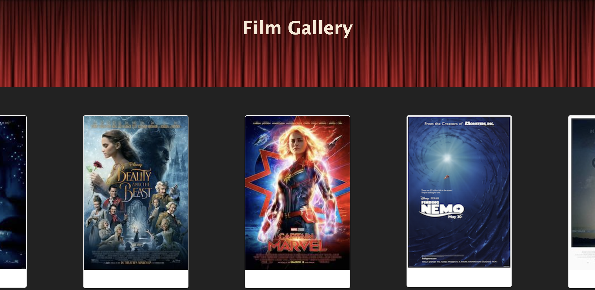
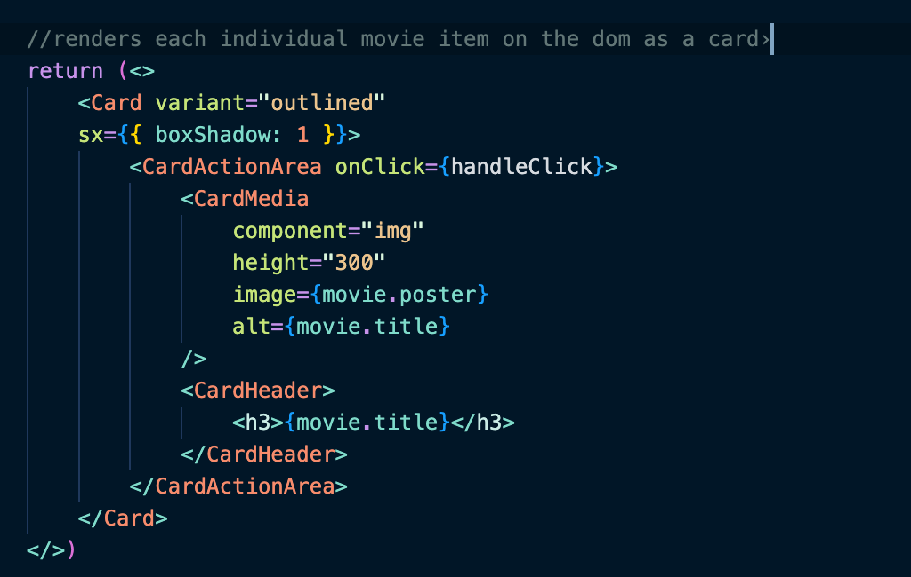
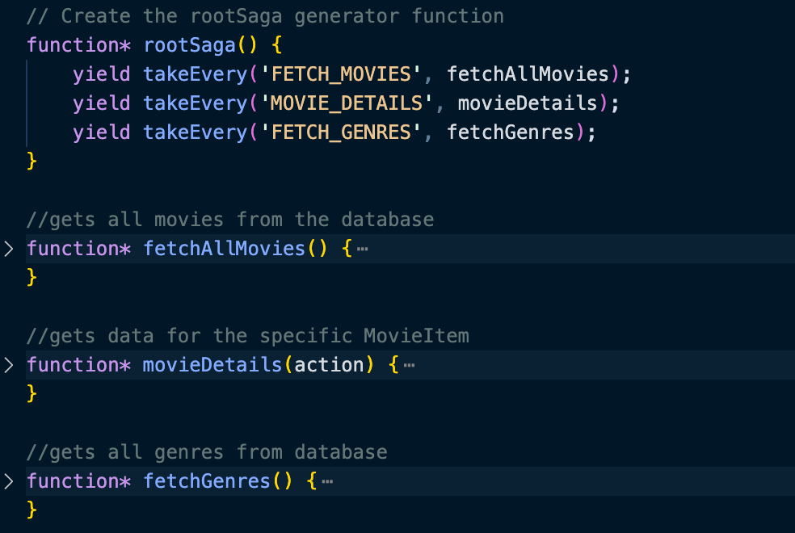
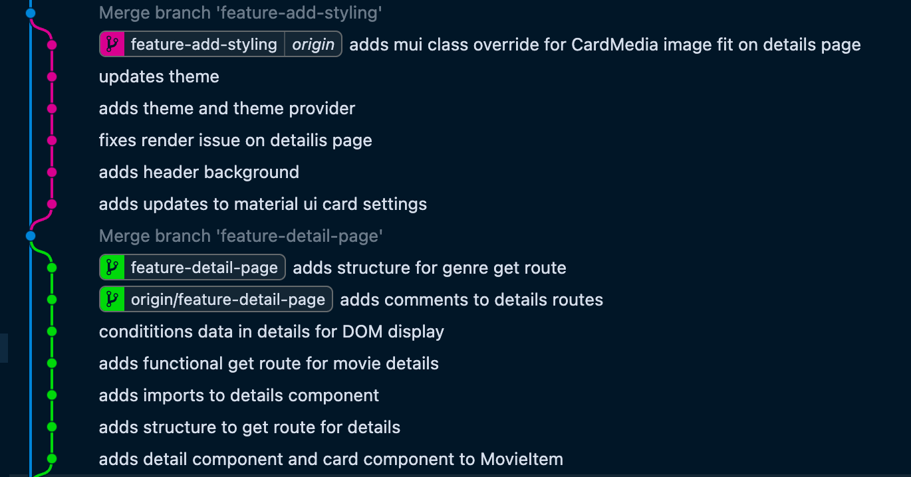

# Film Gallery

This app is a simple film poster gallery for displaying movie posters and the details associated with each movie. 

## Description

#### MaterialUI and Cards
The app relies heavily on Material UI Cards for the styling: this was my first time implementing Cards in any real way. I found they worked incredibly well with flexbox for display on the home page, but I struggled to land on exactly what kind of style I wanted for the details page. 

#### Redux-saga
The app also relies on saga and its generator functions to manage axios calls to the server and assign values to the redux reducers. In the future, I would have liked to break these out into separate components to make the index.js file more manageable.

#### Git Branching
I will always take the opportunity to practice git branching and merging. I've come to enjoy having a clean and functional main branch. 

